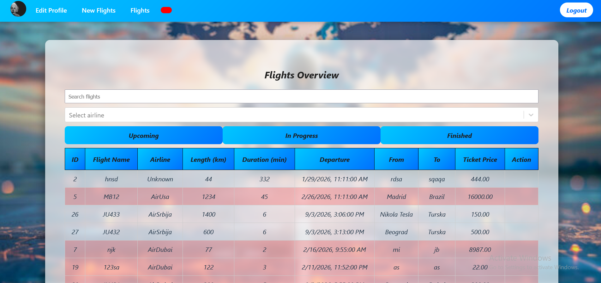
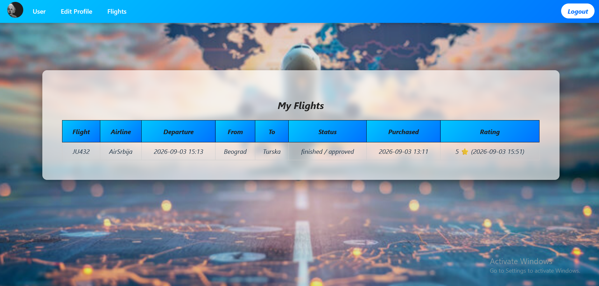

This project is a web application that simulates a flight booking and management system with real-time features and multiple user roles.
Features

User registration and login (JWT authentication) Role-based access (User, Manager, Admin) Flight creation, approval, and cancellation Flight search and booking Asynchronous ticket processing Real-time updates using WebSockets Flight rating system PDF report generation
Architecture

Frontend: React (JavaScript)
Backend: Python Flask

Two PostgreSQL databases (users & flights) REST API + WebSocket communication
User Capabilities

Browse and search flights Book tickets View purchased flights Rate completed flights
Technologies

Python (Flask) React (JavaScript) PostgreSQL JWT Authentication WebSockets
How to Run the Project
Backend setup (Flask)

cd backend python -m venv venv venv\Scripts\activate pip install -r requirements.txt python app.py
Flight Service

cd backendFlights python -m venv venv venv\Scripts\activate pip install -r requirements.txt python flights.py
Frontend (React)

cd frontend cd vite-project npm install npm start
Purpose

This project was developed to practice building a distributed system with real-time communication and modern web technologies.

## # Flight Management System

## Login

## Register

## Dashboard

## 

